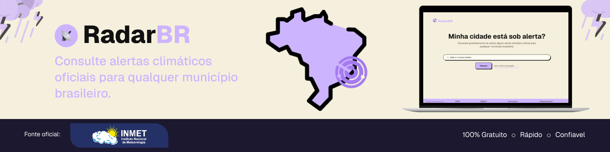
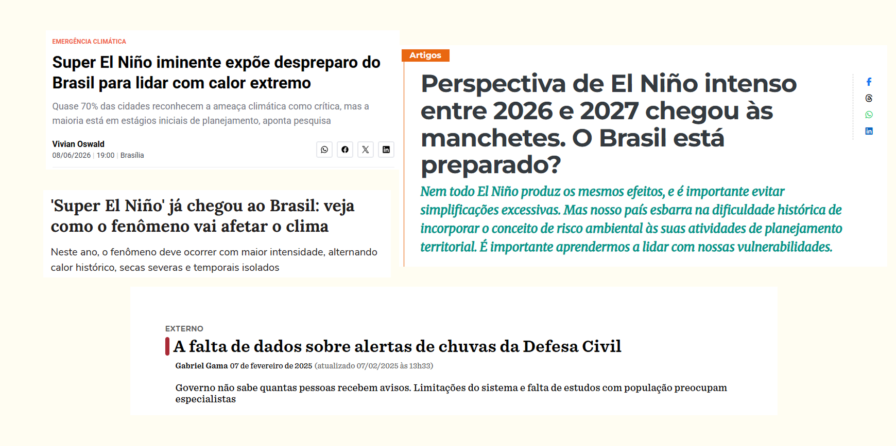
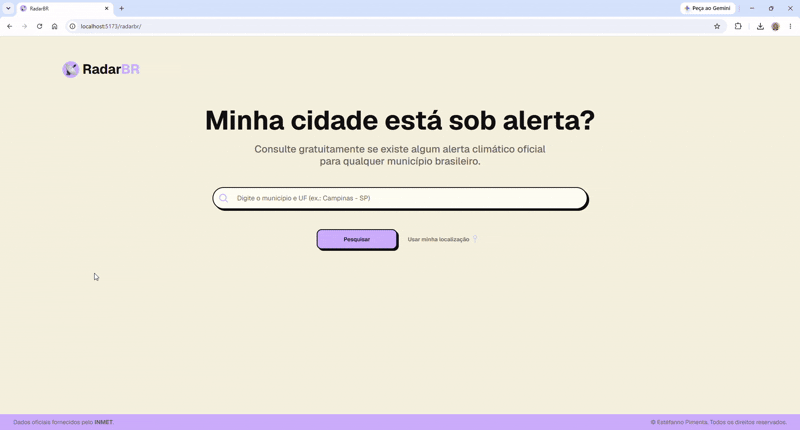
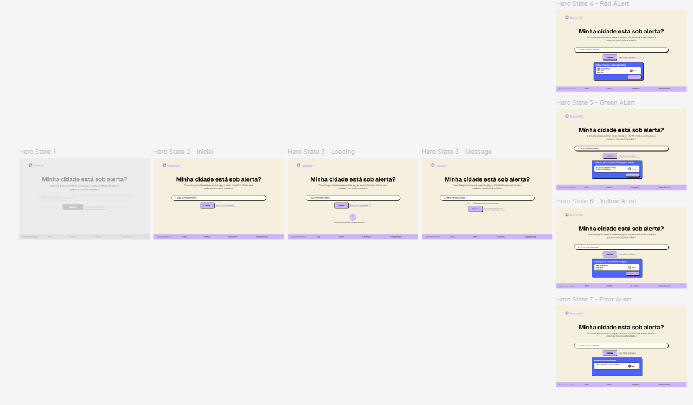
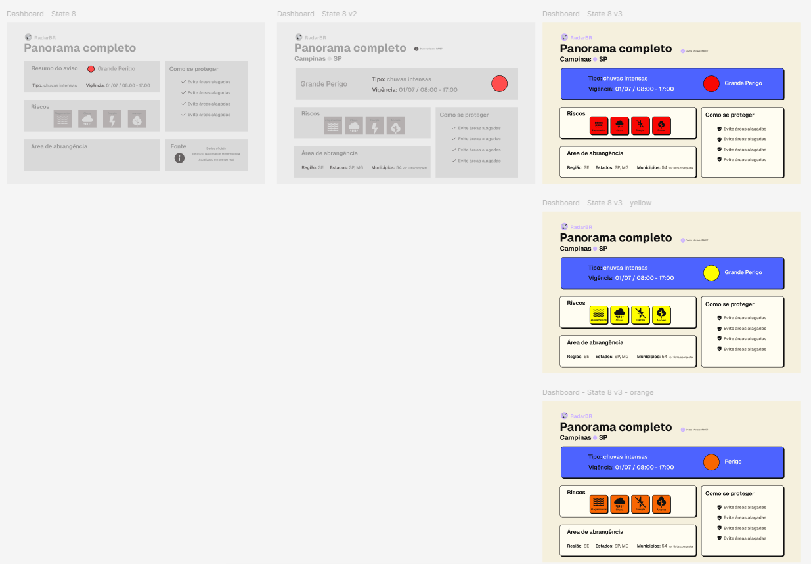
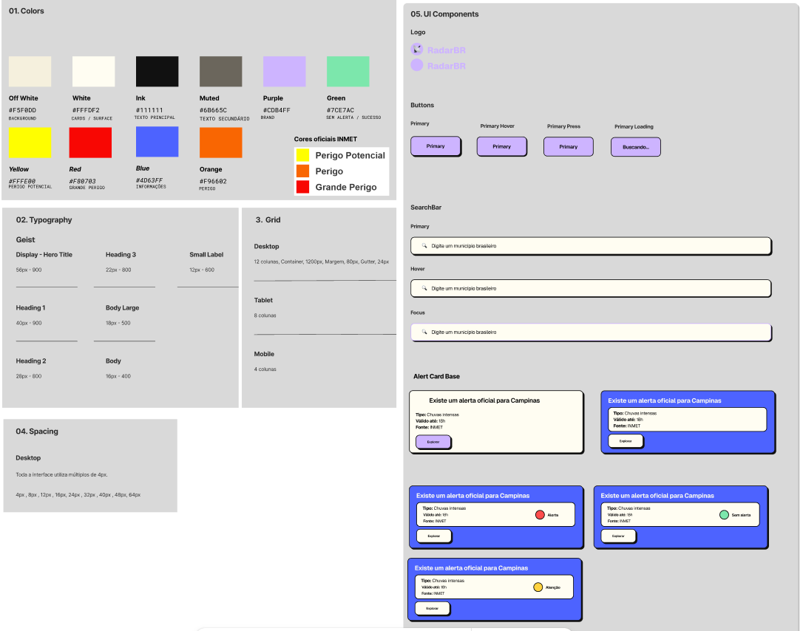

<p align="center">
    
</p>

# 📡 RadarBR

> **Case Study | Front-End Engineering • UX/UI**

RadarBR é uma aplicação web desenvolvida para facilitar o acesso da população a alertas climáticos oficiais emitidos pelo Instituto Nacional de Meteorologia (INMET).

O projeto foi concebido como um estudo completo de **pesquisa**, **UX**, **design de interfaces** e **desenvolvimento Front-End**, buscando transformar dados públicos em uma experiência simples, acessível e intuitiva.

---

# 🎯 Problema e contexto

<p align="center">
    
</p>

Eventos climáticos extremos têm se tornado cada vez mais frequentes no mundo e e no Brasil.

Durante períodos de chuvas intensas, ondas de calor e fenômenos como o **Super El Niño**, torna-se fundamental que a população consiga descobrir rapidamente se sua cidade está sob alerta.

Entretanto, atualmente existem desafios como:

- dificuldade em localizar rapidamente alertas oficiais;
- informações distribuídas em diferentes plataformas;
- comunicação excessivamente técnica;
- pouca integração entre dados e experiência do usuário.

Esses desafios motivaram o desenvolvimento do RadarBR.

O RadarBR nasceu da observação de um problema real.

Embora o Brasil possua instituições responsáveis pelo monitoramento climático, como **INMET**, **INPE**, **CEMADEN** e as Defesas Civis, o acesso rápido às informações ainda ocorre por meio de diferentes portais institucionais, dificultando consultas durante situações de risco.

Ao invés de desenvolver apenas mais um consumidor de APIs, este projeto buscou investigar como princípios de **UX Design** podem tornar essas informações mais acessíveis e compreensíveis para qualquer cidadão.

O projeto foi inspirado pelo aumento da frequência dos eventos climáticos extremos associados ao fenômeno **El Niño**, bem como pelas dificuldades brasileiras relacionadas à prevenção e comunicação desses riscos.

#### Referências

-- https://www.jota.info/coberturas-especiais/matriz/super-el-nino-iminente-expoe-despreparo-do-brasil-para-lidar-com-calor-extremo

-- https://jornal.unesp.br/2026/05/26/perspectiva-de-el-nino-intenso-entre-2026-e-2027-chegou-as-manchetes-o-brasil-esta-preparado/

-- https://www.nexojornal.com.br/externo/2025/02/07/alertas-de-chuvas-da-defesa-civil

-- https://www.terra.com.br/vida-e-estilo/super-el-nino-ja-chegou-ao-brasil-veja-como-o-fenomeno-vai-afetar-o-clima,df29dcdeb383f3162b47629f487114a1we2lwe9q.html#google_vignette

---

# 💡 A Solução

### Demonstração do fluxo completo da aplicação

<p align="center">
    
</p>

O RadarBR propõe uma experiência centrada no usuário para consulta de alertas climáticos oficiais.

Em vez de exigir que o usuário navegue por diferentes páginas institucionais, a aplicação reúne as informações essenciais em uma única interface, organizada em dois momentos.

### Consulta rápida

A Home permite verificar rapidamente se existe algum alerta oficial ativo para qualquer município brasileiro.

O foco é responder imediatamente à pergunta:

> **"Minha cidade está sob alerta?"**

### Exploração dos detalhes

Caso exista um alerta, o Dashboard apresenta informações complementares como:

- severidade;
- período de validade;
- riscos associados;
- recomendações de segurança;
- municípios afetados;
- fonte oficial dos dados.

Essa organização segue o princípio de **Progressive Disclosure**, revelando detalhes somente quando necessários.

---

# 🔍 Pesquisa

Antes da implementação foi realizado um processo de pesquisa para compreender:

- funcionamento dos alertas oficiais do INMET;
- contexto dos eventos climáticos extremos no Brasil;
- desafios da comunicação de riscos;
- boas práticas de UX para aplicações informativas.

---

# 🎨 Processo de Design

O RadarBR foi desenvolvido seguindo um fluxo completo de design antes da implementação.

```text
Pesquisa
        ↓
Definição do Problema
        ↓
UX Research
        ↓
Wireframes
        ↓
Design System
        ↓
Prototipação (Figma)
        ↓
Implementação
        ↓
Testes
        ↓
Responsividade
        ↓
Deploy
```

## Wireframes

Após os wireframes foi criado um protótipo de alta fidelidade no Figma para validar a experiência antes da implementação.

### Home

<p align="center">
    
</p>

### Dashboard

<p align="center">
    
</p>

---

## Design System

Foi desenvolvido um Design System próprio para garantir consistência visual durante toda a implementação.

Incluindo:

- Paleta de cores
- Tipografia
- Grid
- Espaçamentos
- Componentes reutilizáveis
- Estados visuais
- Sistema de Badges

<p align="center">
    
</p>

---

# ✨ Funcionalidades

## Consulta de alertas

- Pesquisa por município brasileiro;
- Integração com dados oficiais do INMET;
- Exibição da severidade do alerta.

---

## Dashboard

Visualização detalhada contendo:

- tipo do alerta;
- período de validade;
- severidade;
- riscos;
- recomendações;
- municípios afetados.

---

## Compartilhamento

Utilização da Web Share API para compartilhar rapidamente alertas climáticos.

<p align="center">
    
</p>

---

# 🎯 Decisões de UX

Durante o desenvolvimento foram aplicados diversos princípios de UX.

### Progressive Disclosure

A Home apresenta apenas a informação essencial.

Os detalhes completos são exibidos apenas após a consulta.

### Feedback

- Estados de carregamento;
- Feedback para erros;
- Feedback para ausência de alertas;
- Feedback para geolocalização.

### Navegação

- Autocomplete;
- Navegação por teclado;
- Enter;
- Mouse.

### Acessibilidade

- Componentes semânticos;
- Navegação por teclado;
- Atributos ARIA;
- Contraste visual.

### Responsividade

Interface adaptada para:

- Desktop;
- Notebook;
- Tablet;
- Smartphones.

---

# 🛠️ Tecnologias

## Front-End

- React.js
- Vite
- JavaScript (ES6+)
- CSS3

## APIs

- INMET
- IBGE
- Geolocation API
- Web Share API

## Ferramentas

- Figma
- Git
- GitHub
- GitHub Pages

---

# 📂 Arquitetura

```text
src
│
├── assets
├── components
├── pages
│   ├── Home
│   └── Dashboard
├── services
├── App.jsx
└── main.jsx
```

---

# 🚀 Próximos Passos

- Histórico de pesquisas;
- Favoritar municípios;
- Notificações em tempo real;
- Integração com Defesa Civil;
- Mapa interativo;
- Progressive Web App (PWA);
- Internacionalização;
- Testes automatizados.

---

# 📚 Reflexões do Projeto

O RadarBR foi desenvolvido como um projeto completo, envolvendo todas as etapas da construção de um produto digital.

Ao longo do desenvolvimento foram consolidados conhecimentos em:

- UX Research;
- Wireframing;
- Design System;
- Prototipação no Figma;
- Arquitetura de Componentes em React;
- Consumo de APIs REST;
- Gerenciamento de Estado;
- Responsividade;
- Acessibilidade;
- Integração entre pesquisa, design e implementação.

Mais do que desenvolver uma aplicação funcional, este projeto reforçou a importância de compreender o problema antes da implementação, utilizando pesquisa, design e validação da experiência do usuário como parte do processo de desenvolvimento.

---

# 🔗 Links

## 💻 Aplicação

https://estefpimenta.github.io/radarbr/

## 📁 Repositório

https://github.com/estefpimenta/radarbr
